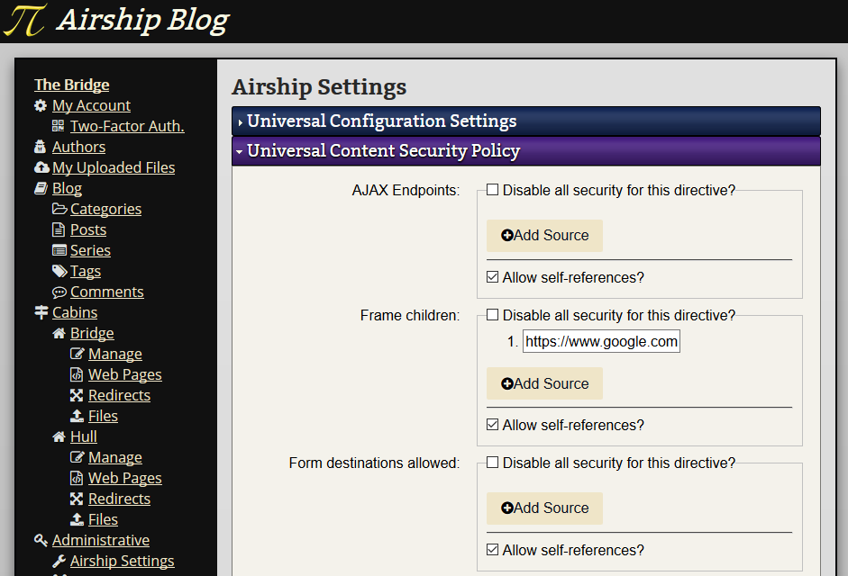
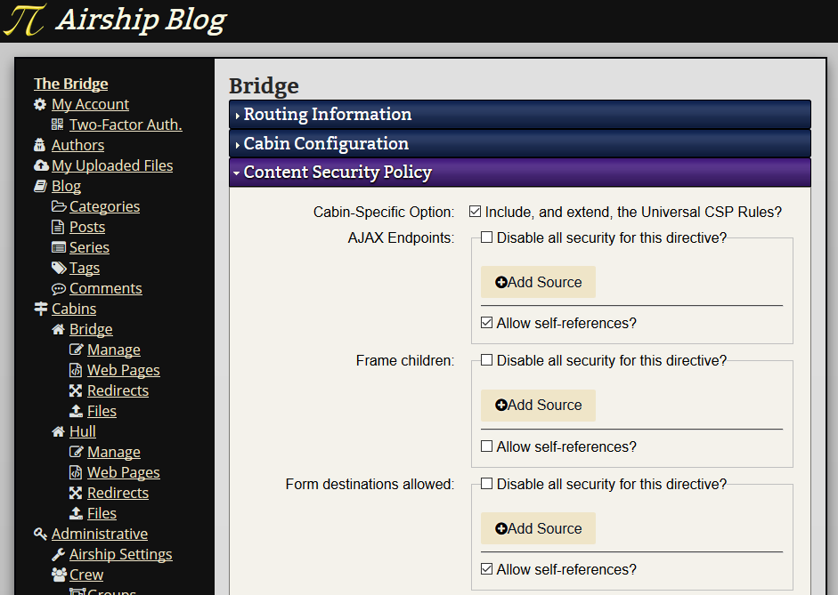

# Managing Content-Security-Policy Headers

Content-Security-Policy headers are like a seatbelt for your passengers. In the
unfortunate event of a XSS vulnerability, it adds a layer of exploit mitigation
enforced by the user's browsers. Although XSS vulnerabilities in Airship should
be a rare occurrence (at worst), these headers are offered in case one ever
surfaces.

There are two places where Content Security Policies are managed:

1. Under **Administrative** > **Airship Settings**
   * This defines the default/Universal Content Security Policy.
2. For each cabin, under **Manage**
   * This defines the Content Security Policy at a per-Cabin level.

## Universal Content Security Policy

This is the base policy for your Airship install. Cabins' Content Security
Policies may be inherited from the Universal rule set. (This inheritance is
completely optional, of course.)

### Options

* **Disable all security for this directive?**
  * Not recommended. Disables that CSP directive and may weaken security.
* **Allow self-references?**
  * Allow resources from the same domain name to be loaded? This is usually
    OK to leave enabled.
* **Allow data URIs?**
  * When in doubt, deny.
* **Allow unsafe inline?**
  * Recommendation: Keep this turned off for Javascript. You may want to also
    keep it turned off for CSS unless you happen to inline a lot of CSS rules
    instead of using classes.
* **Allow eval()?** (JavaScript only)
  * Some JavaScript templating engines require `eval()` to function properly.
    We highly recommend you keep this turned off.

The **Add Source** button allows you to specify a third-party domain name that
you wish your users' browsers to permit third party resources be loaded from
without any additional checks. This is recommended for third-party APIs such
as ReCAPTCHA or CDNs.

## Why is Google whitelisted by default?

* Google Web Fonts (for the default Motif)
* ReCAPTCHA support (if enabled)

## Cabin-Specific Content Security Policies

Cabins have one additional option: **Include, and extend, the Universal CSP
Rules?** If checked, you can only add exceptions ot the Universal rules, not
lock it down further. If you wish for one Cabin to me more restrictive than
the others, uncheck it.

